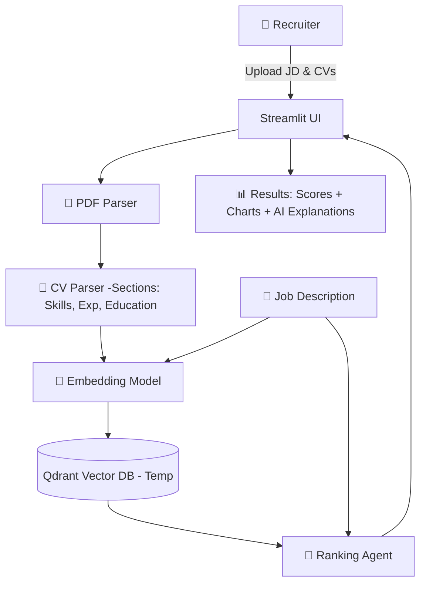

# 🤖 IntelliHire – AI-Powered CV Ranking System

**IntelliHire** is an AI-driven recruitment assistant that helps HR teams and hiring managers **analyze and rank CVs against a Job Description (JD)**.  
It uses advanced **LLM reasoning (Ollama + Qwen/Mistral)** and **semantic search (Qdrant)** to provide **ranked candidates, explanations, and visual insights**.

---

## ✨ Features

- 📤 **Upload CVs (PDF) + JD**  
- 🧩 **AI-powered CV parsing** (LLM or rule-based fallback)  
- 📊 **Scoring & Ranking** (Semantic + Skills + Experience)  
- 🏆 **AI explanations** for rankings  
- 📈 **Interactive dashboard** with charts & analytics  
- 🔒 **Privacy by design** – no long-term CV storage (temporary in-memory ranking only)

---

## ⚙️ Tech Stack

- **Frontend**: [Streamlit](https://streamlit.io/) (UI)  
- **LLM**: [Ollama](https://ollama.com/) (Qwen2.5 / Mistral, quantized for efficiency)  
- **Vector DB**: [Qdrant](https://qdrant.tech/) (Dockerized, session-only collections)  
- **Embeddings**: [Sentence Transformers](https://www.sbert.net/)  
- **Backend**: Python 3.12, LangChain, PyMuPDF  

---

## 📂 Project Structure

```bash
intellihire_ai/
├── app/                     # Streamlit UI
│   ├── main.py              # Landing page
│   ├── pages/
│   │   ├── upload.py        # Upload JD & CVs
│   │   ├── results.py       # Show ranking results + analytics
│   │   └── settings.py      # Config panel
│
├── src/
│   ├── agents/
│   │   └── ranking_agent.py # AI Ranking Agent
│   ├── config/
│   │   └── settings.py      # Global settings
│   ├── database/
│   │   └── vector_db.py     # Qdrant wrapper
│   ├── models/
│   │   └── llm_handler.py   # Ollama LLM wrapper
│   ├── parsers/
│   │   ├── pdf_parser.py    # PDF parsing
│   │   └── cv_parser.py     # CV structure extractor
│   └── utils/
│       └── logger.py        # Logging setup
│
├── tests/                   # Unit & integration tests
│   ├── test_vector_db.py
│   └── integration/
│       └── test_pipeline.py
│
├── docker-compose.yml        # Docker services (Qdrant + app)
├── Makefile                  # Automation shortcuts
├── requirements.txt          # Python dependencies
└── README.md
```

## 🔄 Data Flow



## 🚀 Setup & Usage

### 1. Clone the repo

```bash
git clone https://github.com/your-username/intellihire_ai.git
cd intellihire_ai
```

### 2. Install dependencies

```bash
pip install -r requirements.txt
```

### 3. Run Qdrant (Docker)

```bash
docker-compose up -d
```

### 4. Start Ollama (separately on host)

```bash
ollama pull qwen2.5:7b-instruct-q4
ollama serve
```

### 5. Launch Streamlit UI

```bash
streamlit run app/main.py
```

Open → http://localhost:8501 🎉

## ✅ Example Workflow

1. Paste Job Description in text box.
2. Upload multiple CVs (PDF).
3. Click Process & Rank.
4. Get:
   - Ranked candidates
   - Scores (Semantic, Skills, Experience)
   - Explanations
   - Charts (Bar + Radar)

## 📌 Roadmap

- [ ] Add real-time parsing progress bar
- [ ] Support batch ranking export (CSV/Excel)
- [ ] Add custom weighting for scoring dimensions
- [ ] Deploy as SaaS-ready microservice

## 🔒 Privacy Note

- IntelliHire does not persist CVs or JDs.
- Each ranking session creates a temporary vector DB collection, which is deleted after results are generated.

---

**Note**: This repository is for presentation purposes only. For source code or any information about the project, please contact Rafi.
